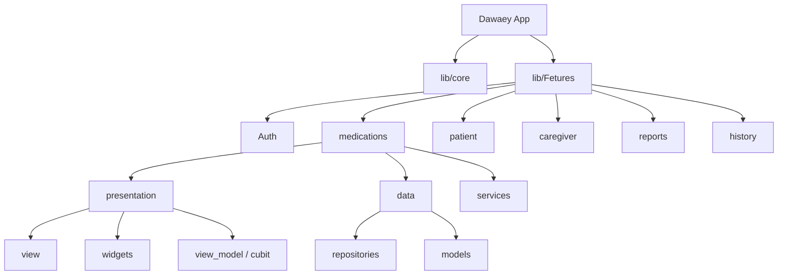

 <h1>Dawaey-Medication-Reminder-App 💊</h1>
A comprehensive Flutter application designed to help patients and caregivers track and manage medication schedules effectively. The app features a role-based system for both patients and their caregivers to ensure medication adherence.

## 📱 Screenshots
 <tr>
  


## Features

*   **Role-Based Access**: Support for both Patient and Caregiver accounts. Caregivers can monitor and manage medications for their linked patients.
*   **Authentication**: Secure login and registration using Firebase Authentication.
*   **Medication Management**: Add, edit, and delete medications with specific dosages, frequencies, and intake times.
*   **Dose Tracking**: Track whether a medication dose was taken, missed, or is pending.
*   **Local Notifications**: Receive timely reminders for upcoming medication doses using `flutter_local_notifications`.
*   **Reports & Statistics**: View daily, weekly, monthly, and yearly reports on medication adherence with visual charts.
*   **History Logs**: View past medication records and schedules.
*   **Offline Support/Local Cache**: Uses Hive for local caching where applicable.

## Tech Stack & Packages

*   **Framework**: Flutter (SDK ^3.10.4)
*   **State Management**: BLoC / Cubit (`flutter_bloc`)
*   **Backend / Database**: Firebase (Auth, Firestore)
*   **Local Storage**: Hive (`hive`, `hive_flutter`)
*   **Notifications**: `flutter_local_notifications`, `timezone`
*   **UI / Components**: 
    *   `table_calendar` & `date_picker_timeline` for date selection.
    *   `month_year_picker` for monthly reports.
    *   `flutter_svg` for scalable vector icons.
    *   `image_picker` for profile pictures.
*   **Localization**: `flutter_localizations` (Arabic RTL UI)

## Getting Started

### Prerequisites

*   Flutter SDK installed (version 3.10.4 or higher).
*   A connected device or emulator for testing.
*   Firebase project setup (requires placing your `google-services.json` / `GoogleService-Info.plist` in the appropriate android/ios directories).

### Installation

1.  **Clone the repository** (if applicable).
2.  **Install Dependencies**:
    ```bash
    flutter pub get
    ```
3.  **Environment Variables**:
    *   Ensure you have a `.env` file in the root directory if the app relies on specific environment keys (e.g., for APIs).
4.  **Run the app**:
    ```bash
    flutter run
    ```

## Architecture

The project follows a feature-first architectural approach to maintain separation of concerns:



*   `lib/Features/Auth`: Authentication, Login, Signup, Onboarding.
*   `lib/Features/medications`: Medication models, services, and UI screens for adding/managing meds.
*   `lib/Features/patient` & `lib/Features/caregiver`: Role-specific home screens and dashboards.
*   `lib/Features/reports`: Logic and UI for adherence statistics and charts.
*   `lib/Features/history`: Past records UI.
*   `lib/core`: Shared utilities, themes, routing, and configurations.
## 👥 Developers

[Mohamed Medhat](https://github.com/Mohamed-MX), 
[Mohamed Amir](https://github.com/mohamedibraim), 
[Omar Sewan](https://github.com/omarsa123) ,
[Ahmed Fathy](https://github.com/ahmedfathy44) 
